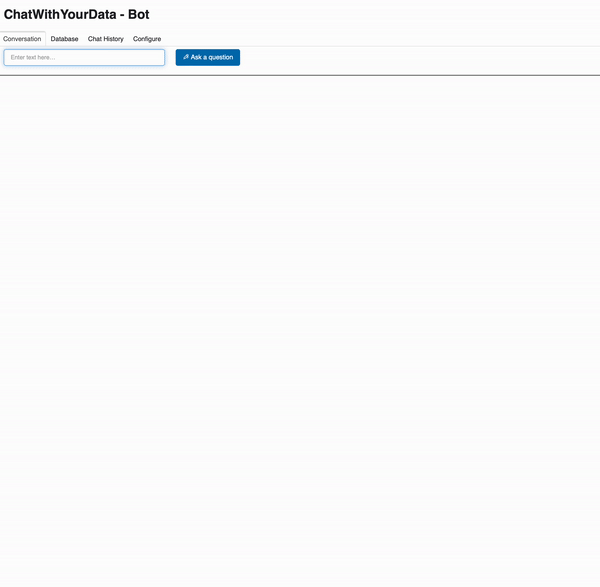

# Chat with your data

This repository is based on the deeplearning.ai course [Chat with your data](https://www.deeplearning.ai/short-courses/langchain-chat-with-your-data/)

The purpose of the course is to show you how you can build applications using LangChain, OpenAI embeddings, vector store such as Chroma DB to be able to "chat" with your own data.

# Demo app 


# How to setup the app

1. Install poetry 

    ```
    curl -sSL https://install.python-poetry.org | python3 -
    ```

2. Clone the repository 

    ```
    git clone https://github.com/laurauzcategui/chat_with_your_data.git

    cd chat_with_your_data
    ```

3. Enable the environment 

    ```
    poetry install 
    poetry shell
    ```

4. Run jupyter

    ```
    jupyter notebook 
    ```

Note: All the relevant notebooks are in: `/src`

# How to run the demo? 

 After you have followed the setup steps above, all except the `jupyter` command, you can run the Demo  and play with it by following the next steps: 

 1. Create a `.env` file under the root of your repo

    Set the content to be your OPENAI API key. It should look like this: 

    ```
    OPENAI_KEY=sk-
    ```

2. Run the demo

    From the root of your repo

    ```
    cd src 
    python app.py
    ```

3. Boom :) Have fun!


----
# Lessons 

## Lesson 1 - Document loading

Your data is usually structured or unstructured, and to be able to talk with it, you need to load it, so that, you can start working on it, such as: 

- Exploring what is the content of your data
- Splitting it into smaller chunks of data so it can be readable by models 
- Pre-processing it before it's transformed into an embedding 

On this lesson, the facilitator gives you an intuition of the different loaders available, such as PDF, WebLoaders and Video loaders like Youtube. 

Note: I ran into an issue using the Youtube loader, perhaps because now youtube blocks this kind of content. If you find a solution feel free to open an issue with the solution.

## Lesson 2 - Document splitting 

Usually, once we have loaded our data and have it ready to be used, we need to do a bit more steps, such as transform it into smaller chunks, so it can fit the model context window, or perhaps you wish to do certain transformations before passing it to the model like filtering. 

Those are the different [text splitters](https://python.langchain.com/docs/modules/data_connection/document_transformers/#types-of-text-splitters) supported by LangChain

On this lesson, the facilitator walks us through 2 main splitters: 

1. Recursive splitter, which as its name says, splits recursively the text. 
2. Character splitter, which use a set of defined characters. 

There is also a way to build context character splitters, in this case is done using the Markdown text splitter, where you define the sections and the split will be done according to the sections provided to split on. 

## Lesson 3 - Vector stores and embeddings 

Nice, nearly there! Once we have our data already split into smaller chunks, we need to be able to transform the "text" of this data into a readable format for the model, and for doing so, we can use [OpenAI Embedding](https://platform.openai.com/docs/guides/embeddings) models. 

Basically, an Embedding model, takes text and transform it into multi-dimensional vectors in the space that can help you to identify for example, what phrases, words are similar to each other. 

On this lesson, the facilitator goes through an small example using sentences to be able to compare them between each other, to later on, take Lecture notes from CS229 and pass it through embeddings and store those into a vector store such as [Chroma DB](https://www.trychroma.com)

Well, after you have all your vectors indexed into a vector store you can start asking questions, such as: 

- What is the most basic algorithm in Machine learning? 

and the vector store will retrieve the top N vectors that are most similar to the question being asked.

## Lesson 4 - Retrievers

Oh right! This lesson was a bit of fun, where you are not only working with Vector stores and Embeddings, but how to retrieve the information and pass it to a Language model to give you more contextualized responses. 

First, it starts by showing there are other ways to search, meaning you can use other techniques different than similarity. On this particular case, we can observe Maximum marginal relevance (MMR). 

> MMR algorithm looks at the pool of all possible results and first picks the one most relevant to your query. Then, for the next pick, it not only considers how relevant another piece of information is but also how different it is from what's already been selected

On lesson 3, we have found some pitfalls and errors, those can be solved using retrievers with metadata. 

For example, when asking about lecture 3, instead of just querying, you can also filter by particular metadata. On this particular case the source ( lecture3.pdf ) 

Meanwhile this idea seems enticing, imaging you have thousands of documents referring to lecture 3, you don't want do it by hand, instead you use a self-query retriever where you pass the metadata info to retriever or filter by, in this case the source and the page from the lecture.

Yet another one to look out if you are querying super large content is to use Contextual Compression retrievers, where instead of pasing the full doc to the app, you pass it to a base retriever that will fetch the more relevant documents to then compressed the info with the bits and pieces you need.

At the end of the lecture, the facilitator talks about other types of retrievers, such as using SVM, TF-IDF techniques which of course do not use semantic search. 

## Lesson 5 - Question answering 

This lesson was based on the final building block of the course which is using LLMs to answer questions based on what we have seen before, embeddings and retrievers, where the LLM just take the info from the retrievers as context and it's able to form an answer to the question. 

It's important to highlight here the usage of RetrievalQA chain. There are multiple [chains](https://python.langchain.com/docs/modules/chains) that can be used with Langchain and its worth giving it a read for the different use cases that it can support. 

On this particular case, you can either, pass directly a question along with the retriever and the llm or you can form a Prompt template to give specific instructions to the llm about how it should read and response. 

On the other hand, there is a parameter to be able to use different different chain types. For example: map_reduce and refine. 

What each of this chain_types does? 
- map_reduce: this is a two step process, first the chain applies LLM chain to each document ( map step) and then it pass all documents to combine them a produce and output ( reduce step )
- refine: this is an incremental production of the output, where the chain takes the documents and generates an initial answer based on the first doc, then loops on the remaining ones to refine the answer. This process is sequential as the building ocurss upon the previous one. 

Limitations of the chains ? 
- They do not have memory. Which will be seen on the last lesson. 

## Lessson 6 - Chat with your data

Fresh out of the oven I could get this one up and running! :-) 

This one is a summary of all the content of the course in just one go where you could build out an end to end application. 

Basically, you load a PDF and it gets splitted into chunks as well as passed through embeddings to be able to generate the retriever. 

Later on, you can ask questions, and it will give you answers based on the PDF file generated and it will output the answers in reply to the user. 

Tips from this lesson: 
- I've modified the App to be able to run it using Chat Feed provided natively by Panel
- You can upload any data in PDF you might have and ask questions about it 
- Be mindful that while this use OpenAI, those actions using embeddings and chat models cost money $$$. 


## What next? 
- Explore using other models such as Mistral 
- Expand to use other types of files, such as, csv 
- Expand to upload multiple files at once 


